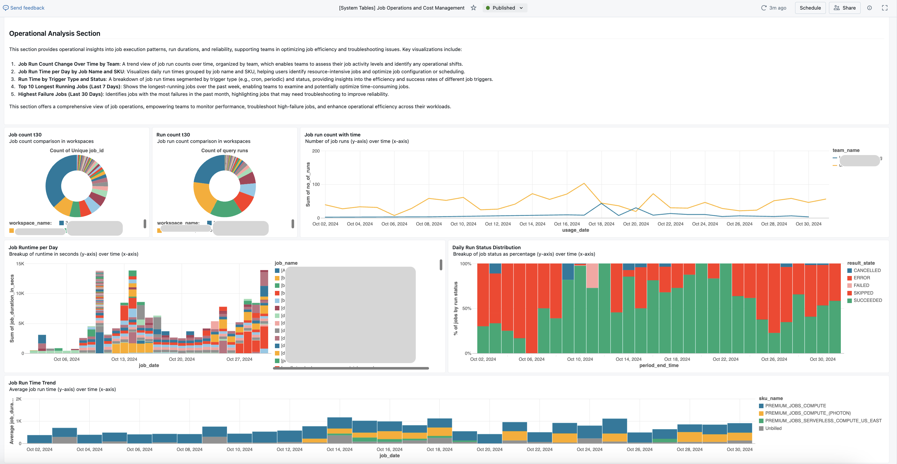

# Databricks Dashboard Suite

<!-- TOC -->
* [Databricks Dashboard Suite](#databricks-dashboard-suite)
  * [Descripción General](#descripción-general)
  * [Dashboards Incluidos](#dashboards-incluidos)
  * [Estructura del Repositorio](#estructura-del-repositorio)
  * [Configuración y Uso](#configuración-y-uso)
    * [[Opción 1] Usando Databricks Git folders (Repos)](#opción-1-usando-databricks-git-folders-repos)
    * [[Opción 2] Descargando e importando archivos manualmente al workspace](#opción-2-descargando-e-importando-archivos-manualmente-al-workspace)
    * [Ejecutar el Notebook `create_dashboards`](#ejecutar-el-notebook-create_dashboards)
    * [Completar el Despliegue](#completar-el-despliegue)
  * [Actualización de Dashboards](#actualización-de-dashboards)
  * [Tablas y Funciones Creadas Durante el Despliegue](#tablas-y-funciones-creadas-durante-el-despliegue)
      * [**Tablas**](#tablas)
      * [**Funciones SQL**](#funciones-sql)
  * [Conclusión](#conclusión)
    * [Descargo de Responsabilidad](#descargo-de-responsabilidad)
<!-- TOC -->

## Descripción General

Este repositorio contiene una suite de dashboards analíticos para entornos Databricks, diseñados para proporcionar información detallada sobre la asignación de costos, métricas de rendimiento, linaje de datos y eficiencia de cómputo. Estos dashboards, construidos utilizando las [Databricks System Tables](https://docs.databricks.com/en/admin/system-tables/index.html), soportan la gestión eficiente de recursos a través de workspaces, entidades y equipos dentro de Databricks, ofreciendo tanto vistas generales de alto nivel como herramientas de análisis en profundidad.


## Dashboards Incluidos

1. **[Databricks Unified Cost Analysis Dashboard](system_table_dashboards/%5BSystem%20Tables%5D%20Databricks%20Unified%20Cost%20Analysis.lvdash.json)**  
   Se enfoca en la distribución general de costos a través de varios tipos de compute, como clusters de propósito general, Delta Live Tables (DLT), jobs, inferencia de modelos y SQL. Ideal para obtener información rápida de costos, incluye:  
   * **Gasto Diario por Tipo de Compute a lo Largo del Tiempo** – Visualiza tendencias de costos para cada tipo de compute (ej., SQL, Jobs, DLT, inferencia de modelos).
   * **Comparación de Gastos** – Muestra el gasto en los últimos 30 días vs. los 30 días anteriores.
   * **Porcentaje de Cambio de Costo Semanal** – Muestra fluctuaciones de costos semana tras semana.
   * **Gasto Diario por Workspace** – Desglosa los costos por workspace.
   * **Costo por Tipo de Compute y Workspace** – Analiza el gasto más reciente de 30 días por cada tipo de compute y workspace.  
   Para análisis en profundidad y segmentado, consulte los dashboards específicos a continuación.

2. **[Job Operations and Cost Management Dashboard](system_table_dashboards/%5BSystem%20Tables%5D%20Job%20Operations%20and%20Cost%20Management.lvdash.json)**  
   Analiza costos relacionados con jobs, eficiencia operacional y utilización de recursos del cluster. Este dashboard ayuda a monitorear el rendimiento de jobs, gestionar costos de cluster e identificar jobs de alto costo:
   * **Costo Diario por Workspace y SKU** – Monitorea costos diarios relacionados con jobs a través de workspaces.
   * **Costo por Equipo y Asignación de Usuario** – Asigna costos por equipo y usuario.
   * **Análisis de Tiempo de Ejecución de Jobs** – Rastrea el conteo de jobs, tendencias de ejecución y tiempos de ejecución agrupados por nombre de job, SKU y tipo de trigger.
   * **Jobs Más Costosos y con Fallos** – Identifica jobs costosos, con mayor cantidad de fallos y con más reintentos a lo largo del tiempo.
   * **Análisis de Rendimiento de Cluster** – Muestra utilización de memoria y CPU, uso de DBR desactualizado y conteo de jobs con workers fijos o compute de propósito general.

3. **[DBSQL Cost & Query Performance Dashboard](system_table_dashboards/%5BSystem%20Tables%5D%20DBSQL%20Cost%20&%20Query%20Performance.lvdash.json)**  
   Diseñado para cargas de trabajo SQL, este dashboard proporciona análisis en profundidad de costos SQL, rendimiento de queries y eficiencia de warehouses. Ayuda a rastrear el uso de SQL por equipo y workspace:
   * **Costo Diario por Workspace y SKU** – Rastrea costos SQL diarios por workspace.
   * **Costo por Equipo y Asignación de Usuario** – Atribuye costos por equipos y usuarios.
   * **Cambio de Costo a lo Largo del Tiempo** – Cambio semana tras semana en costos SQL.
   * **Detalles de Queries Costosas** – Tabla que lista queries costosas para mejoras de rendimiento.
   * **Análisis de Conteo y Tiempo de Ejecución de Queries** – Análisis de conteos de queries, tiempos de ejecución, tiempos de cola y desgloses por tipo de statement y aplicación de origen.
   * **Utilización de Warehouse** – Información sobre conteos de warehouse, tiempos de actividad de cluster y derrames de queries.

4. **[Data Lineage and Catalog Utilization Dashboard](system_table_dashboards/%5BSystem%20Tables%5D%20Data%20Lineage%20and%20Catalog%20Utilization.lvdash.json)**
   Proporciona información sobre el linaje de datos, patrones de uso y utilización de catálogos. Soporta esfuerzos de gobernanza de datos mostrando acceso a entidades, tendencias de catálogos y acceso y linaje específico de tablas:
   * **Acceso a Tablas vs. Path** – Patrones de acceso a través de varias entidades.
   * **Distribución de Usuarios Activos** – Gráfico circular mostrando usuarios activos.
   * **Uso de Tipo de Entidad a lo Largo del Tiempo** – Cambios en patrones de uso de entidades.
   * **Uso de Catálogo y Equipo** – Uso de catálogos por equipos y tipos de entidades.
   * **Detalles de Acceso a Tablas** – Incluye frecuencia de acceso por entidad, acceso a nivel de usuario y linaje de tablas upstream/downstream.



## Estructura del Repositorio

```plaintext  
├── README.md                                                               # Descripción del proyecto y documentación  
├── system_table_dashboards                                                 # Carpeta conteniendo todos los dashboards y código  
│   ├── [System Tables] Databricks Unified Cost Analysis.lvdash.json        # Código para Databricks Unified Cost Analysis Dashboard  
│   ├── [System Tables] Job Operations and Cost Management.lvdash.json      # Código para Job Operations and Cost Management Dashboard  
│   ├── [System Tables] DBSQL Cost & Query Performance.lvdash.json          # Código para DBSQL Cost & Query Performance Dashboard  
│   ├── [System Tables] Data Lineage and Catalog Utilization.lvdash.json    # Código para Data Lineage and Catalog Utilization Dashboard  
│   ├── create_dashboards.ipynb                                             # Código Python para desplegar los dashboards a tu Databricks  
└── └── extract_dashboard  .ipynb                                           # Código Python para extraer un dashboard específico
```
## Configuración y Uso

El proyecto debe ser importado a un workspace de Databricks mediante alguna de estas 2 opciones:
- Usando Databricks Git folders (Repos)
- Descargando e importando archivos manualmente al workspace

### [Opción 1] Usando Databricks Git folders (Repos)
* **Configurar Git folders** - Usa [Git folders](https://docs.databricks.com/en/repos/repos-setup.html) en Databricks para clonar este proyecto y ejecutar notebooks. Pasos a seguir:
  * Abre tu workspace de Databricks.
  * Navega a **Workspace** en la barra lateral, (opcional \- selecciona cualquier carpeta) luego haz clic en el botón **Create**. 
  * Selecciona **Git folder**.
  * Agrega esto en Git repository URL para clonarlo en tu entorno Databricks: https://github.com/danielveraec/databricks-monitoring-suite
  * Haz clic en **Create Git folder**.  
    Una vez clonado, verás todos los archivos del repositorio en tu Workspace. Haz clic en la carpeta **system_table_dashboards**.

### [Opción 2] Descargando e importando archivos manualmente al workspace

* **Descargar Archivos Requeridos** - Para comenzar, descarga cada uno de los archivos [ubicados](system_table_dashboards) en la carpeta `system_table_dashboards` de este repositorio. Estos archivos contienen todos los recursos y dependencias necesarias para habilitar los dashboards.
* **Importar al Workspace de Databricks** - Después de descargar, [importa](https://docs.databricks.com/en/notebooks/notebook-export-import.html#import-a-notebook) cada uno de los archivos a tu workspace de Databricks para asegurar que todos los archivos estén disponibles para uso inmediato. Para hacer esto:

  * Abre tu workspace de Databricks.  
  * Navega a **Workspace** en la barra lateral, (opcional \- selecciona cualquier carpeta) luego crea una carpeta llamada **system_table_dashboards** (o similar).
  * Entra en la carpeta y haz clic en el menú kebab (tres puntos verticales) y selecciona el botón **Import**.  
  * Elige cada uno de los archivos que descargaste y súbelos a tu workspace.

### Ejecutar el Notebook `create_dashboards`
En tu workspace, abre el notebook `create_dashboards`. Este notebook está diseñado para desplegar los dashboards y configurar los recursos requeridos. Incluye varios parámetros, comenzando con **`actions`**:

* **`actions` (Dropdown Multi-Selección)**: Este parámetro te permite seleccionar tareas específicas a realizar durante el despliegue, con las siguientes opciones:  
  * **All**: Ejecuta todas las acciones disponibles, adecuado para el primer despliegue ya que inicializa todos los componentes requeridos para los dashboards.  
  * **Deploy Dashboards**: Despliega solo los dashboards sin publicar u otras acciones de configuración.  
  * **Publish Dashboards**: Publica los dashboards, haciéndolos disponibles para uso en el workspace.  
  * **Create Functions**: Configura funciones SQL personalizadas necesarias dentro de los dashboards.  
  * **Create/Refresh Tables**: Actualiza o refresca las tablas que proporcionan datos esenciales a los dashboards.  
**Nota**: Para el primer despliegue, selecciona **All** para asegurar que todos los pasos de configuración, incluyendo despliegue de dashboards, creación de funciones y refrescos de tablas, sean completados.  
* **`warehouse` (Dropdown)**:   
  Este parámetro lista todos los SQL warehouses disponibles en el workspace. Selecciona uno del dropdown para ser usado por los dashboards para ejecutar queries y procesar datos. **Serverless warehouses** son preferidos ya que ofrecen rendimiento optimizado y están denotados por \*\* al final de su nombre. Elegir un warehouse apropiado ayuda a asegurar manejo eficiente de datos a través de todos los dashboards.  
* **`catalog` (Entrada de Texto)**:  
  Especifica un catálogo UC donde el usuario tenga **permisos de lectura y escritura**. Este catálogo alojará las [tablas y funciones requeridas](#tablas-y-funciones-creadas-durante-el-despliegue) por los dashboards. Si el catálogo especificado no existe todavía, será creado automáticamente durante el despliegue.  
* **`schema` (Entrada de Texto)**:  
  Proporciona el nombre del schema dentro del catálogo seleccionado. Este schema almacenará todas las tablas y funciones necesarias. Como el catálogo, si el schema no existe, será creado como parte de la configuración.  
* **`tags_to_consider_for_team_name` (Entrada de Texto Separada por Comas)**:  
  Este parámetro define qué claves de tags deben ser usadas para identificar equipos en gráficos que muestran métricas de uso por equipo. Proporciona una lista de claves de tags separadas por comas, basada en la convención de etiquetado de la organización para clusters, warehouses, jobs, etc.  
  * Por ejemplo:  
    * Si los clusters están etiquetados con `team_name:<nombre del equipo>`, ingresa `team_name`.  
    * Si múltiples claves de tags son usadas (ej., `team_name` para algunos clusters y `group_name` para otros), proporciona ambas claves, como `team_name,group_name`. Esta configuración asegura que todos los equipos relevantes sean capturados con precisión en los dashboards.

**Parámetros de Account API [Opcionales]**  
Estos parámetros solo son requeridos si quieres que **nombres de workspace** (en lugar de IDs de workspace) se muestren dentro de los dashboards. Los dashboards están construidos usando system tables, que actualmente almacenan solo IDs de workspace. Estos parámetros permiten que los dashboards se conecten a la consola de cuenta para recuperar nombres de workspace mediante el Databricks Account API. Ten en cuenta que se requiere acceso a nivel de cuenta (usando M2M OAuth) para poblar la tabla **workspace\_reference** con nombres de workspace. [¿Cómo obtenerlos?](https://docs.databricks.com/en/dev-tools/auth/index.html#how-do-i-use-oauth-to-authenticate-with-databricks)

* **`account_host`**: La URL del host de cuenta de Databricks.  
* **`account_id`**: El identificador para la cuenta de Databricks.  
* **`client_id`**: El client ID del service principal de Databricks, usado para autenticación machine-to-machine (M2M).  
* **`client_secret`**: El client secret para el service principal de Databricks, requerido para autenticación M2M.

Si estos parámetros se dejan en blanco, la tabla **workspace\_reference** será creada sin nombres de workspace, con IDs de workspace poblados en la columna `workspace_name` en su lugar. Para aquellos sin acceso a la consola de cuenta, los nombres de workspace pueden ser agregados manualmente a la tabla `workspace_reference` más tarde, permitiendo que los dashboards muestren nombres de workspace donde se desee.

### Completar el Despliegue

Una vez que todos los parámetros estén configurados, ejecuta el notebook `create_dashboards` en un **cluster con soporte de Unity Catalog (UC)** (serverless es recomendado). Ejecutar el notebook desplegará todos los dashboards, que luego estarán disponibles para uso bajo la sección **Dashboards** en tu workspace. Haz clic en `[System Tables] Databricks Unified Cost Analysis Dashboard`. Este contendrá enlaces a los otros dashboards.

## Actualización de Dashboards

Los dashboards pueden ser actualizados a medida que los datos o configuraciones cambian con el tiempo. El notebook `create_dashboards` proporciona múltiples acciones que pueden ser usadas de forma ad-hoc para refrescar o mantener tus dashboards:

* **Publish Dashboards**: Re-publica dashboards al workspace para asegurar que cualquier actualización hecha a las definiciones de dashboards sea reflejada. Esto puede ser usado si se hacen cambios manuales y necesitan ser re-desplegados a través del entorno.

* **Refresh Tables**: Asegura que las tablas de referencia, como workspace_reference y warehouse_reference, estén actualizadas. Ejecutar esta acción periódicamente es esencial para capturar nombres nuevos o actualizados de warehouses y detalles de workspace para reportes precisos.

Además del notebook `create_dashboards`, el notebook `extract_dashboard` está disponible para capturar actualizaciones a cualquier dashboard. Dado que `create_dashboards` despliega dashboards directamente desde archivos JSON en el repositorio, cualquier cambio manual hecho a dashboards en el workspace será sobrescrito cuando `create_dashboards` se re-ejecute.

Usa el notebook **`extract_dashboard`** para capturar estos cambios:

* Si se hace cualquier cambio manual en cualquiera de los dashboards, ejecuta el notebook **`extract_dashboard`** seleccionando ese dashboard específico como parámetro.  
* Este notebook extrae la última versión de cualquier dashboard en el workspace y la guarda de vuelta al archivo JSON correspondiente.  
* Ejecutar `extract_dashboard` asegura que los despliegues futuros con `create_dashboards` incluirán todas las modificaciones manuales, previniendo la pérdida de actualizaciones. 

Estas acciones proporcionan flexibilidad para mantener y refrescar dashboards eficientemente, ayudando a mantener las visualizaciones alineadas con los datos y configuraciones más recientes.


## Tablas y Funciones Creadas Durante el Despliegue

Como parte del despliegue, varias tablas y funciones son creadas para soportar el análisis de datos y visualización dentro de los dashboards. Estos objetos se almacenan en el catálogo y schema especificados definidos durante la configuración.

#### **Tablas**

1. **`workspace_reference`**  
   * **Descripción**: Almacena mapeos entre `workspace_id` y `workspace_name` para mostrar nombres legibles dentro de los dashboards.  
   * **Uso**: Habilita el uso de nombres de workspace en lugar de IDs. Si se proporcionan parámetros de acceso a nivel de cuenta, esta tabla es poblada automáticamente con nombres de workspace. De lo contrario, `workspace_id` será usado en lugar de `workspace_name`, con la opción para que los usuarios actualicen manualmente los workspaces comúnmente usados.  
2. **`warehouse_reference`**  
   * **Descripción**: Contiene un mapeo entre `warehouse_id` y `warehouse_name` para hacer referencias de warehouse más eficientes en queries de dashboard.  
   * **Uso**: Mejora el rendimiento del dashboard evitando joins frecuentes con `system.access.audit` para recuperar nombres de warehouse. Las tablas `audit` cubren solo el último año y rastrean warehouses dentro del workspace actual, potencialmente perdiendo nombres de warehouse más antiguos o aquellos de otros workspaces en la cuenta. Para mantener esta tabla actualizada con nombres de warehouse nuevos, los usuarios deben ejecutar frecuentemente la acción **Create/Refresh Tables** en el notebook `create_dashboards`. Una vez que las system tables incluyan nombres de warehouse (roadmap futuro), esta tabla de referencia ya no será necesaria.

#### **Funciones SQL**

1. **`job_type_from_sku`**  
   * **Descripción**: Identifica el tipo de job (ej., classic job, job con Photon, serverless job) desde el SKU.  
   * **Uso**: Proporciona granularidad para análisis de costo de job por tipo de job, ayudando en la comparación de métricas de rendimiento y costo a través de diferentes configuraciones de job.  
2. **`sql_type_from_sku`**  
   * **Descripción**: Determina el tipo de SQL warehouse (ej., Pro, Classic, Serverless) basado en SKU.  
   * **Uso**: Soporta análisis y desgloses de costo para SQL warehouses, dando información sobre patrones de costo y uso a través de tipos de warehouse.  
3. **`team_name_from_tags`**  
   * **Descripción**: Extrae el nombre del equipo basado en claves de tags proporcionadas en el parámetro `tags_to_consider_for_team_name`.  
   * **Uso**: Permite que los dashboards segmenten datos de costos y uso por equipo, incluso si múltiples claves de tags (ej., `team_name`, `group_name`) son usadas a través de clusters para designación de equipo.


## Conclusión

¡Gracias por explorar el **Databricks Dashboard Repository**! Este proyecto tiene como objetivo mejorar tus capacidades de análisis de datos y visualización proporcionando dashboards completos construidos sobre system tables clave.

Esperamos que encuentres estos dashboards útiles para tus necesidades analíticas. Si tienes alguna pregunta, sugerencia, o necesitas asistencia con la configuración y uso, por favor siéntete libre de contactarnos a través de la página de [Issues](https://github.com/danielveraec/databricks-monitoring-suite/issues).

¡Feliz análisis!

### Descargo de Responsabilidad

Este proyecto y los dashboards que lo acompañan no son productos oficiales de Databricks. Son recursos construidos por la comunidad proporcionados tal cual, sin soporte continuo dedicado. Por favor revisa y prueba en tu entorno, ya que están destinados para uso bajo tu propio riesgo.